# Activity-3-Combos

Activity 3 for CS-2611 F23 that tests a specific usage of the Linked List data structure.
Completed by Faycal Kilali, starter code by Ada Clevinger in COMP-2711 Class of MTA.

## Implementation Overview

In order to satisfy the single-responsibility principle and the open-closed principles, I've opted for the following implementation of the specification.

**Combo** houses all the **Move** objects, where the **Move** objects act as **Nodes** in a Linked List. The **Move** objects contain an Integer object within them that houses the damage associated with the **Move**. It also houses the appropriate methods (refer to the JavaDoc of them) to satisfy both general cases, and some edge cases that are relevant to the **ComboADT** specification.

There are 3 pre-made classes that inherit the **Move** class: **Grapple**, **Tackle**, **Disarm**. Those come with their pre-determined Damage values, and are made to show the open-ended aspects of the design.

The **Player** class is a representation of an abstract player that contains the player's health, won rounds, and ID (for the sake of open-ended, we can extend this to more than two players in the future so we use IDs) and the current Combo Move set.

The static **Game** class contains two CONSTANTS that are named adequately to explain their purpose, the `beginGame` method, a bunch of its helper methods, and the main method. The `beginGame` method simulates a fighting game. The players take turns to perform actions. The actions can be adding a move to a Combo at any position or perform their combo. If the player performs the combo, they deal the prorated damage to the other player, then they remove all the moves from their combo as part of the game rules. If the total damage dealt to the player reaches the relevant CONSTANT of the player in value, the player is declared defeated, an increment occurs to the winning player's won rounds, and a new round begins. The comments explain the purpose of the methods.
